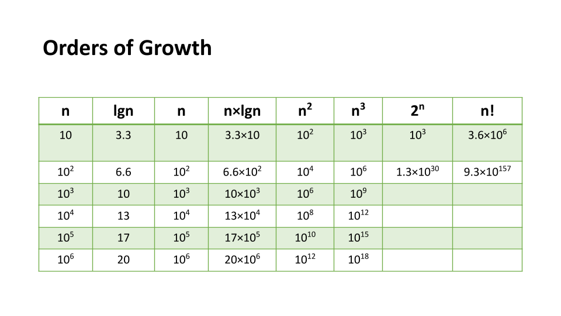
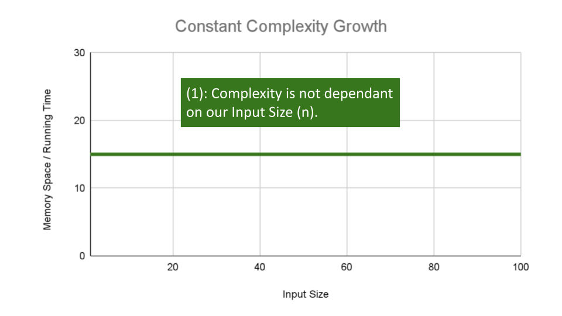
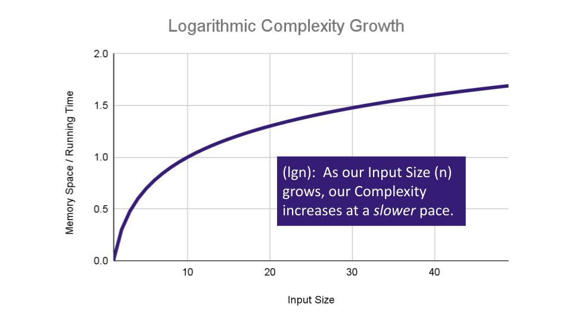
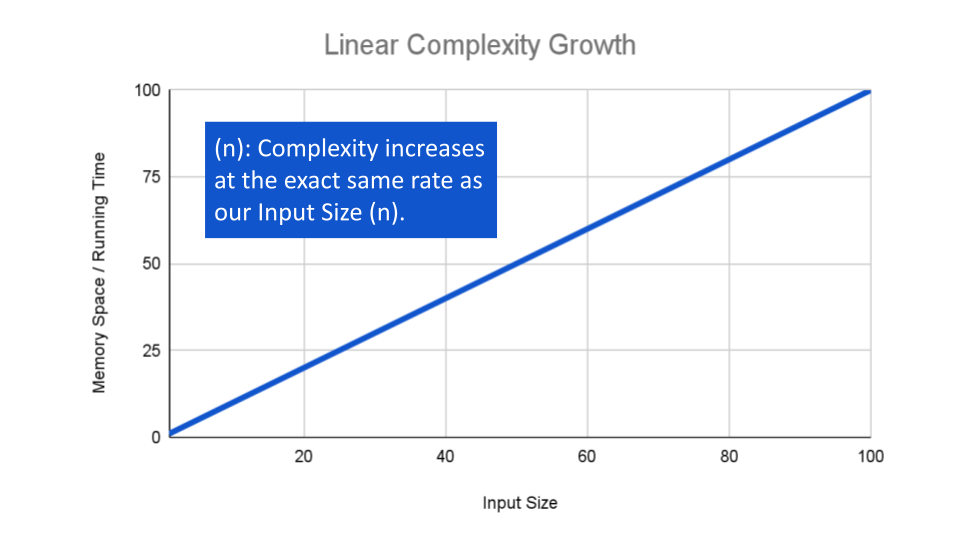
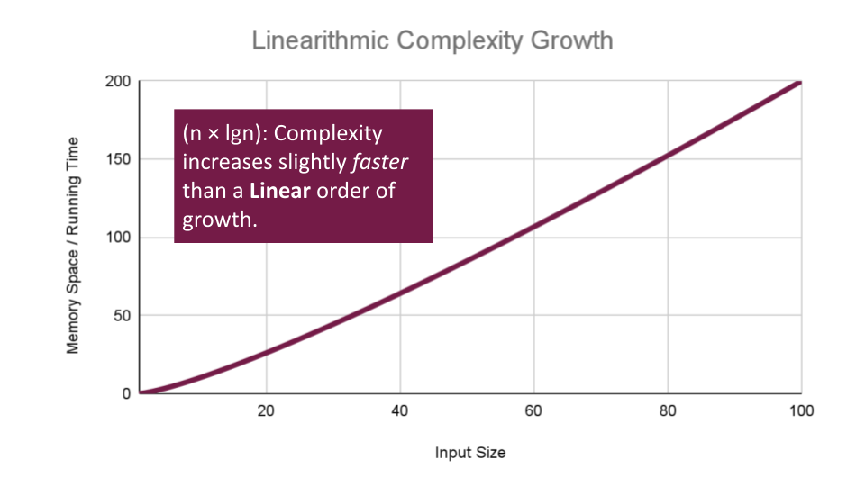
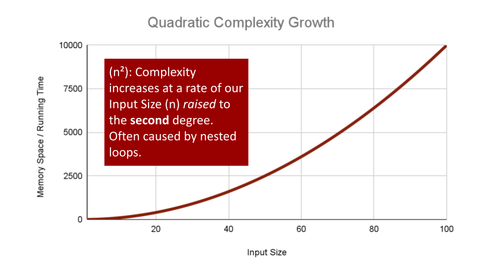
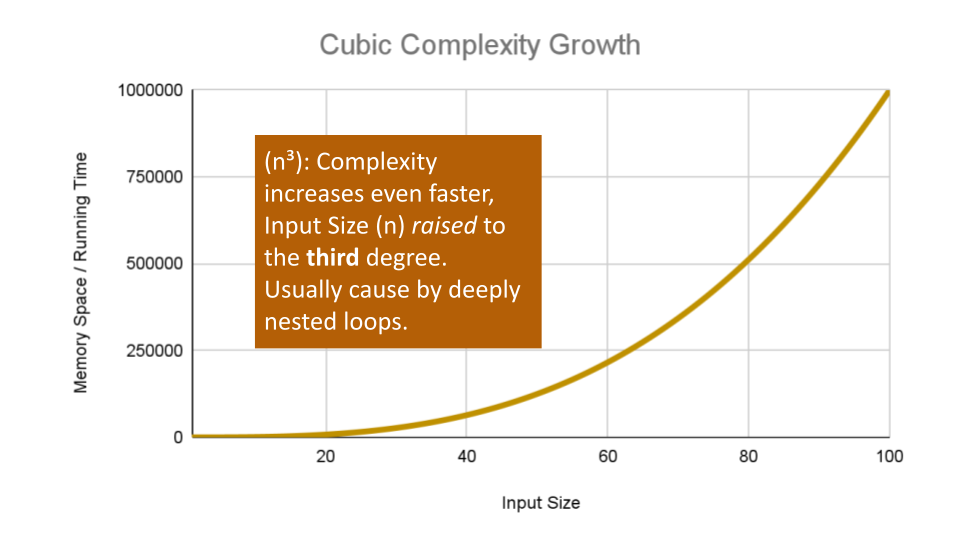
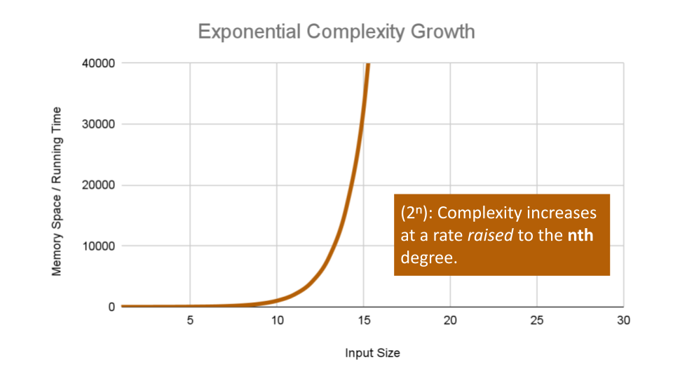
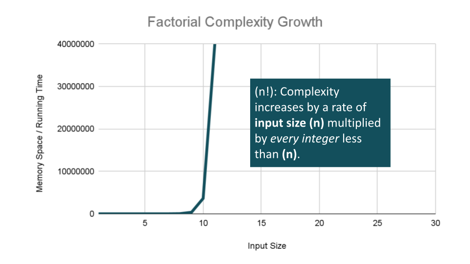
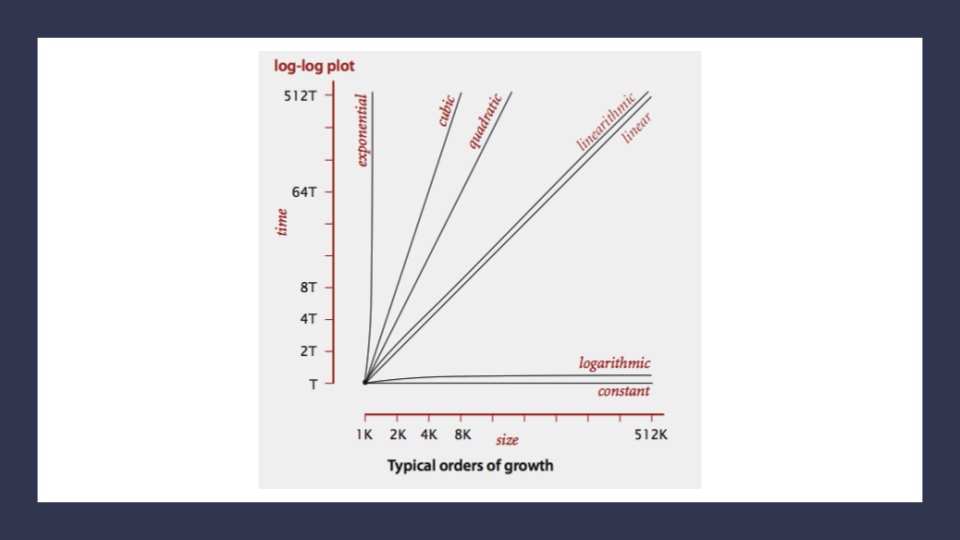

# Big O: Analysis of Algorithm Efficiency

**Big O(oh)** notation is used to describe the efficiency of an algorithm or function. This efficiency is evaluated based on 2 factors:

1. **Running Time** (also known as time efficiency / complexity)  
   > The amount of time a function needs to complete.

1. **Memory Space** (also known as space efficiency / complexity)
   > The amount of memory resources a function uses to store data and instructions.

## Overview

Big O's role in algorithm efficiency is to describe the **Worst Case** of efficiency an algorithm can have in performing it's job. It specifically looks at the factors mentioned above, which we often refer to as **Space** and **Time**.  In order to analyze these limiting factors, we should consider **4 Key Areas** for analysis:

1. **Input Size**
1. **Units of Measurement**
1. **Orders of Growth**
1. **Best Case, Worst Case, and Average Case**

## Input Size
  
Input Size refers to the size of the parameter values that are *read* by the algorithm.  This does **not** simply refer to the number of parameters an algorithm reads, but takes into account the _**size** of each parameter value_ as well.

> Example: If a function uses an array or list as *one parameter*, then the number of elements within that array or list will directly increase the **Input Size** of that parameter.

We will use the letter `n` to refer to the **Input Size** value.

The higher this number, the more likely there will be an *increase* to **Running Time** and **Memory Space**.

## Units of  Measurement

To evaluate a function for **Time** and **Space** complexity,  we need a way to measure each of these factors.

### In order to quantify the *Running Time* in our analysis, we will consider *Three Measurements* of time:

   1. The time in **milliseconds** from the start of a function execution until it ends.
      > For the purposes of Big O, we won't be considering this measurement since different machines will have different individual run times depending on how powerful they are.  Regardless, this will always be a measurement of run-time.
   1. The number of **operations** that are executed.
      > Think of this as the number of lines of code that are executed from start to finish of a function.
   1. The number of **"Basic Operations"** that are executed.
      > "Basic Operation" refers to the operation that is contributing the most to the total running time.  This is usually the most time consuming operation within the inner most loop.

### In order to quantify *Memory Space*, we can consider *Four Sources of Memory Usage* during function run-time:

   1. The amount of space needed to hold the **code for the algorithm**.
      > Think of this as the number of bytes required to store the characters for the instructions specified in your function.
   1. The amount of space needed to hold the **input** data.
      > If direct input data is not considered, we may just refer to this as *Additional Memory Space* since not all functions have direct input values.
   1. The amount of space needed for the **output** data.
   1. The amount of space needed to hold **working space** during the calculation.
      > **Working Space** can be thought of as the creation of variables and reference points as our function performs calculations. This will also include **Stack Space** of recursive function calls ... specifically how memory usage scales relatively with the size of the input.

Always be aware that **Space Complexity** and **Time Complexity** are measured differently and should be analyzed separately.  It's also worth noting that contemporary computing affords most machinees with multiple GigaBytes of working memory, so algorithm space complexity is not as much of a concern as it used to be.  

## Orders of Growth

We can describe overall efficiency by using the input size `n` and measuring the overall Units of Space and Time required for the given input size `n`.  As the value of `n` grows, the **Order of Growth** represents the increase in **Running Time** or **Memory Space**.


> The above table plots an Order of Growth for space and time to a given value n, with the very first column representing the size of n.  Each row cell contains the value for **Running Time** or **Memory Space**.  Depending on which factor you are analyzing.

Each of these notations represents the relationship our Complexity factor has when compared to input size n.  We can use a line chart to better see how 'n' effects our space and time efficiency:


> **Constant Complexity** means that no matter what inputs are thrown at our algorithm, it always uses the same amount of **time** or **space**.  The number `1` is used to represent a constant value. The actual number of units will most likely be greater than `1`, we round this number down to `1` to represent our estimate of complexity that is independant of `n`.
>
> This algorithm has an O(1) constant efficiency, no matter the size of `a` or `b`, this function simply returns the sum of those 2 numbers.
>
> ```plaintext
> ALGORITHM Sum(number a, number b)
> 
>    number val <-- a + b
>    return val
> ```

---

> **Logarithmic Complexity** represents a function that sees a *decrease* in the rate of complexity growth, the greater our value of n.  This can be seen when we are performing calculations on *sorted* data.  For instance if we are searching for a value in a sorted array, we have an idea of where to start searching instead of starting at the first index moving toward `n`:
>
> ```plaintext
>
> AlGORITHM Search(SortedArray[0...n - 1], int SearchValue)
> 
>     number mid <-- n/2
> 
>     firstHalf <-- SortedArray[0...mid]
>     secondHalf <-- SortedArray[mid...n]
>     current <-- SortedArray[mid]
> 
>     if current > SearchValue
>           return Search(firstHalf, SearchValue)
>     if current < SearchValue
>           return Search(secondHalf, SearchValue)
>
>     return current
>
> ```
>
> As `n` grows we can eliminate more values in the input.  We are chopping our input in half with each time we call `Search` in this algorithm, giving us O(lgn) complexity growth.

---

> If an algorithm has **Linear Complexity**, the size of our inputs 'n' will directly determine the amount of **Memory Space** used and **Running Time** length.  This is a very common efficiency and is usually used to denote functions with loops, or often algorithms that use recursion.
>
> The following algorithm loops through an array and creates a sum of their values.  It has to perform a set number of operations for every value that our input of size `n` holds:
>
> ```plaintext
> 
> ALGORITHM SumArray(arr[0...n - 1])
> 
>     number sum <-- 0
> 
>     for number i <-- 0 to n - 1 do
>           sum <-- sum + arr[i]
>
>     return sum   
>
>```
>
> The operation: `sum <-- sum + arr[i]` will run for every value within our input `arr` of size `n`, giving this alorithm O(n) complexity growth.

---

> **Linearithmic Complexity** is used to describe a growth rate of `n` by `lgn`.  This represents complexity that grows with `n`, but also by `lgn`.  Linearithmic functions grow faster than input size n, but not by much.  This can be seen in divide and conquer algorithms such as the Merge Sort have linearithmic complexity growth rates.
>
> A simple example, might include the use our O(lgn) `logarithmic` algorithm `Search`, to search through an array of sorted arrays:
>
> ```plaintext
> 
> ALGORITHM SearchArrays(arrs n)
> 
>     // this is a linear O(n) operation that simply passes each sub array into `Search`
>     for number i <-- 0 to n - 1 do
>        array subArr <-- arrs[i]
> 
>        // Our previous analysis of `Search` tells us this has O(lgn) complexity.
>        Search(subArr)
> 
> ```
>
> We have a basic operation: `Search(arr[i])` that runs O(n) times, and that operation itself has a complexity of O(lgn), giving this algorithm a total complexity of O(n*lgn).

---

> **Quadratic Complexity** describes an algorithm with complexity growing at a rate of input size `n` multiplied by `n`.  This is often seen in algorithms that have nested loops which perform iterative or recursive logic on all values of `n` and immediately iterate or recurse again for each value of `n`.  Often seen in brute force comparison functions that compare all values of an iterable with each other value.
>
> If we wanted to sort our Array with a little less finesse, we can loop through all array values, and loop through all values again:
>
> ```plaintext
> 
> ALGORITHM BubbleSort(arr[0...n - 1])
> 
>     for number i <-- 0 to n - 1 do
> 
>        for number j <-- 0 to n - i - 1 do
> 
>           if arr[j] > arr[j + 1]
>              Swap(arr[i], arr[j])
> 
> ```
>
> This algorithm has a nested for loop which will effectively run the **Basic Operation** of checking and swapping values at worst `n^2` times for O(n^2) complexity.

---

> **Cubic Complexity** is typically just a higher degree of what makes the **quadratic** complexity grow at such a high rate.  We can illustrate this by nesting more loops within our algorithm.
>
> An example of Cubic efficiency could involve an additional set of nested loops,  We can illustrate the insane complexity here by programming a simple counter function that will keep track of how many times our function runs compared to it's input value `n`:
>
> ```plaintext
> 
> ALGORITHM CubicCounter(number n)
> 
>     number count <-- 0
> 
>     for number i <-- 0 to n do
>        for number j <-- 0 to n do
>           for number k <-- 0 to n do
> 
>              count = count + 1
> 
>      return count
>
> ```
>
> This algorithm performs the **Basic Operation**: `count = count + 1` to increment the count variable `n^3` times, for O(n^3) complexity.  If we use `3` as an example input value, `CubicCounter` should return `27` as we increment the `count` `3^3` times.

---

> **Exponential Complexity** represents very rapidly growing complexity, such that whatever our input size `n`, we are performing the same number of iterative or recursive loops as `n`.  If we have to examine subsets of a set of data, and compare against all possible subsets, we may have exponential complexity growth.
>
> The **fibonacci** sequence is a popular case for exponential complexity growth. In the following example, we will be given a number representing the *index* position in the sequence and our algorithm should find the corresponding fibonacci *value*.  Just for reference the Fibonacci sequence is the sequence of numbers in which the previous 2 numbers add up to the next number in the sequence.  Thus we get an ever expanding sequence like so: 1, 1, 2, 3, 5, 8, 13, 21, 34, 55 ... n.
>
> The following calculates the given index value `n` of that sequence:
>
> ```plaintext
>
> ALGORITHM FibonacciIndex(number n)
>
>     if n <= 1
>        return 1
> 
>     return FibonacciIndex(n - 1) + FibonacciIndex(n - 2);
> ```
>
> Let's break this algorithm down a bit so we can see how this complexity increases: Each time we call `Fibonacci` on a number, our algorithm passes the 2 preceding numbers into a recusive loop.  It continues this, until we reach a number equal too or less than 1. At this point the call stack adds up all the 1 values for all the call stack frames that have been called on all numbers that have been passed recursively into our function.  As the value of 'n' increases, we have to push a lot of function calls onto the call stack to finally get a number that reaches a condition to return a value.
>
> If we pass `6` as our 'n' value, our algorithm will calculate the 6th index in the Fibonacci sequence, giving us the fibonacci value: `13`.  For each number we added together to get that fibonacci value (13 to be exact), we had to recursively call Fibonacci.  At worst case we call our function an exponential number of times compared to our input to finally reach our Fibonacci value, leaving us with O(2^n) complexity growth.

---

> **Factorial Complexity** means that the our **space** and **time** requirements grow extremely fast, relative to our input size.  At this rate we are performing an extreme amount of calculations for every value within our input of size `n`.  This aften happens with we need to calculate all possible permutations of something like a string or an array.
>
> For example, how many ways could you arrange a deck of cards?  If we were to calculate every possible arrangment of the cards in our deck, we would have an O(n!) "factorial" complexity growth.  Let's look at an algorithm that can perform such a task:
>
> ```plaintext
> 
> combination: card[]
> 
> ALGORITHM FiftyTwoFactorial(
>     combination[] generatedCombinations
>     card[] currentCardCombination
>     card[] cardsToCombine
> )
>   
>     if cardsToCombine is not Empty
>        for currentCard in cardsToCombine do
>           nextCombination <-- currentCardCombination + currentCard
>           remainingCards <-- remove currentCard from cardsToCombine
>           FiftyTwoFactorial(generatedCombinations, nextCombination, remainingCards)
> 
>     else
>        add currentCardCombination to generatedCombinations
> 
>     return generatedCombinations
> ```
>
> There is a lot going on here, so let's break this down:
>
> You may first notice that our recursive function receives 3 discrete parameters:  An Array of `generatedCombinations` which holds each permutation or combination we create, that will start as an empty array, but will eventually be filled with arrays of cards.  Next is the `currentCardcombination` array, which is the current permutation of cards from our deck.  Finally there is the `cardsToCombine` array which start as the entire deck of cards we would like to find all permutations of.
>
> The complexity really ramps up as we loop through our initial deck of cards, since we are recursively calling this function with a different combinations of cards each time.  We are looping and calling `FiftyTwoFactorial` as we place our cards into `nextCombination`, and `remainingCards` with the `currentCard` removed.  This will cause the **Basic Operation** to be called `n!` **times** using `n!` **space** at the worst case, giving us O(n!) complexity growth for both factors.
>

---
Here's a look at all of these lines plotted together:


> Notice how the lines for **Quadratic** up through **Exponential** orders of growth shoot our complexity through the figurative roof of our chart.  Even with small values of input size, we see large amounts of time and most likely space required to complete our function.

## Worst Case, Best Case, Average Case

Even though **Big O** describes the **Worst Case** for algorithm efficiency, we can still think about **Best** and **Average** cases. Each of these cases could be analyzed as we consider the overall question:  As inputs `n` fluctuate in size and order, how does this affect our orders of Growth?

* **Worst Case**: The efficiency for the worst possible input of size `n`

This case runs the longest for all possible inputs of n.  This assumes that if we were sorting values, inputs are completely unsorted and searched values either don't exist or are at the last to be searched.

* **Best Case**: The efficiency for the best possible input of size `n`

This case runs the quickest for all possible inputs of `n`.  In the case of sorting, this assumes that values are sorted, and so searched-for values are easy to find.

* **Average Case**: The efficiency for a "typical" or "random" input of size `n`.

The average case makes a typical assumption about the possible inputs of size 'n' and how they might affect efficiency.  This is *NOT* the best case and worst case averaged together.

### Asymptotic Notations

For each of the cases mentioned above, academics use the following notations in the following table to describe the differing complexities of an algorithm.  Also (as mentioned earlier), we are focused more on Big O as an industry standard, but it's helpful to be aware that there are other ways we can analyze algorithmic efficiencies.

* **Big O(oh)**: This notation describes the **Worst Case** for an algorithm.  The Order of Growth used represents the *upper bounds* of **Time** and **Space**.
* **Big Omega**: This notation describes the **Best Case** for a given algorithm.  The Order of Growth used represents the *lower bounds* of **Time** and **Space**.
* **Big Theta**:  This notation describes the **Average Case**.  The Order of Growth used represents the *tight bound* of **Time** and **Space**.
   > We use the term *tight* since, in order to predict a "typical" input, we need an idea of what makes our function perform better or worse. *Tight* means that the upper and lower can both be set by this Order of Growth.

## Review

* **Big O**: The *worst case* analysis of algorithm efficiency.
* **Running Time**: The amount of time required for an algorithm to complete.
* **Memory Space**: The amount of memory resources required for an algorithm to complete.
* **Input Size**:  Represented by the variable `n`,  the total size of values used as parameters in an algorithm.
* **Big Omega**:  The *best case* analysis of algorithm efficiency.
* **Big Theta**: The *typical* or *random case* used for analysis of algorithm efficiency.


