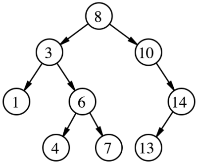

# Interview 1

Sum of numbers in a binary tree

## Specifications

- Read all of the following instructions carefully.
- Act as an interviewer, giving a candidate a code challenge
- Score the candidate according to the [Whiteboard Rubric](https://docs.google.com/spreadsheets/d/1scthkmARfzAFZrSYAp6LA2coOaoWUWbSzMbtIU4jcHw){:target="_blank"}.
- You are free to offer suggestions or guidance (and see how they respond), but don't solve the challenge for the candidate.

## Feature Tasks

- Describe to the candidate the following problem:

```plaintext
Find the sum of all the odd numbers in a binary search tree.
```

- Any of the traversals (depth or breadth) are acceptable.

## Structure

Familiarize yourself with the grading rubric, so you know how to score the interview.

Look for effective problem solving, efficient use of time, and effective communication with the whiteboard space available.

Every solution might look a little different, but the candidate should be able to test their solution with different inputs to verify correctness.

Assign points for each item on the Rubric, according to how well the candidate executed on that skill.

Add up all the points at the end, and record the total at the bottom of the page.

## Example

Considering the following Tree:



Output: 24

## Documentation

Record detailed notes on the rubric, to share with the candidate when the interview is complete.

## Solution

<details>
  <summary>Algorithm</summary>
  We can traverse the tree any way we like, but as we traverse we should test each value whether it's odd or not, and only add up the numbers that pass the test.
  For an iterative solution we can use a queue to traverse our tree using breadth first ordering.  Starting with the head we can push our root node into the queue.  And loop while the queue is not empty,  dequeueing a node, testing it's value for even or odd and adding the sum.  Then we can push any children into the queue. Eventually when the queue is out of nodes we should have a sum of all odd values.
  If we want to go in depth first order we can use recursion to perform the same test on node values and return either the value of the node, or 0 if the value is even.  Starting with our root node, we can test our node for even or odd values.  If odd, we return the value along with the recursive function calls on the left and right child nodes.  If even, we can return 0 as the value to be added up the call stack.
</details>
<details>
  <summary>PseudoCode</summary>
  <pre></code>algorithm ITERATIVE_BINARY_TREE_SUM:
  declare tree BT <- input Tree
  declare number SUM <- starts at 0
  declare queue QUEUE <- new Queue
  push the root of BT into QUEUE
  while QUEUE is not empty:
    declare node CURRENT <- dequeue a node from QUEUE
    if CURRENT node value is odd:
      add the CURRENT node value to SUM
    add CURRENT.left node to QUEUE if it exists
    add CURRENT.right node to QUEUE if it exists
  return SUM when QUEUE is out of nodes</code></pre>
  <pre><code>algorithm RECURSIVE_BINARY_TREE_SUM:
  declare node ROOT <- input node from our Binary Tree
  if ROOT value is odd:
    return 0 and call RECURSIVE_BINARY_TREE_SUM on left and right
  if ROOT value is even:
    return ROOT value and call RECURSIVE_BINARY_TREE_SUM on left and right</code></pre>
</details>
<details>
  <summary>Big O</summary>
  Both of these solutions will run code for every Node in our Binary Tree, giving us a time complexity of 0(n).  Both solutions also have a space complexity of 0(n), since the recursive solution adds function calls to a call stack for every Node in the input Tree, and the iterative solutions adds all Nodes to a Queue.
</details>
