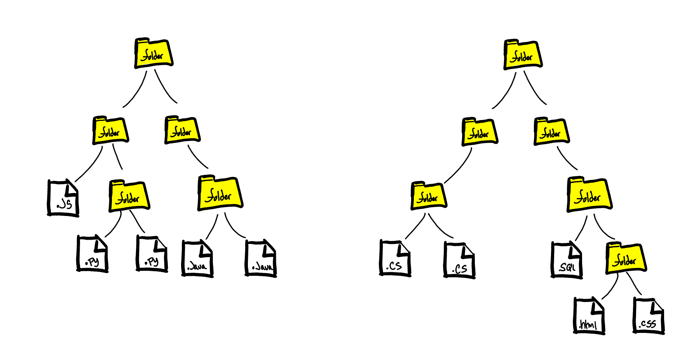
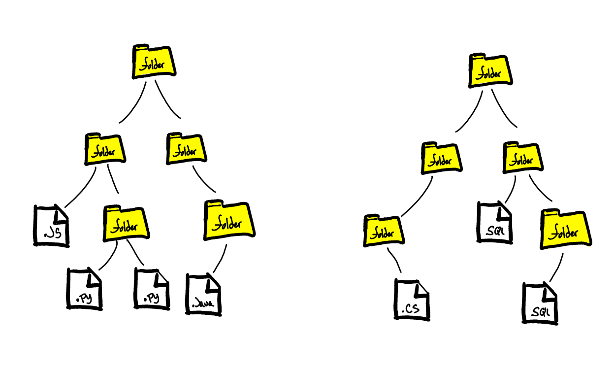

# Interview 02

Compare Trees

## Specifications

- Read all of the following instructions carefully.
- Act as an interviewer, giving a candidate a code challenge.
- Score the candidate according to the [Whiteboard Rubric](https://docs.google.com/spreadsheets/d/1scthkmARfzAFZrSYAp6LA2coOaoWUWbSzMbtIU4jcHw){:target="_blank"}.
- You are free to offer suggestions or guidance (and see how they respond), but don't solve the challenge for the candidate.

## Feature Tasks

Ask the Candidate the following question:

You are working with a file structure with only at most 2 files or folders. Each file directory has either one or two folders/files.

Comparing two different file directories, create a method that takes in 2 directory structures and compares both and determines whether or not they have the same number of individual files.

**The following will come back as true:**

Both trees contain 5 files.

{:target="_blank"}

**The following will come back as false:**

The first tree has 4 files, while the second only has 3.

{:target="_blank"}

## Structure

Familiarize yourself with the grading rubric, so you know how to score the interview.

Look for effective problem solving, efficient use of time, and effective communication with the whiteboard space available.

Every solution might look a little different, but the candidate should be able to test their solution with different inputs to verify correctness.

Assign points for each item on the Rubric, according to how well the candidate executed on that skill.

Add up all the points at the end, and record the total at the bottom of the page.

## Documentation

Record detailed notes on the rubric, to share with the candidate when the interview is complete.

## Solution

  
Algorithm

  We will need to traverse our two separate trees, and count the number of "files" in each tree.  We can then compare those counts together at the end.  We can assert that a Node in the directory tree is a "file" if it is a leaf, or has no right nor left child node.  We can traverse the tree depth first using recursion, and for each node we encounter we can either return 1 if we find the node has both no left or right node, or return our recursive function calls on the left and right node.  For each leaf we find, we will return 1 and add all the other leafs together.

  
PseudoCode

  <pre><code>algorithm COMPARE_TREES:
  declare BinaryTree DIR_1 <- input tree
  declare BinaryTree DIR_2 <- input tree
  declare number DIR_1_FILE_COUNT <- result of COUNT_FILES on DIR_1
  declare number DIR_2_FILE_COUNT <- result of COUNT_FILES on DIR_2
  if DIR_1_FILE_COUNT equals DIR_2_FILE_COUNT
    return true
  else
    return false</code></pre>
  <pre><code>algorithm COUNT_FILES:
  declare node ROOT <- input tree node
  declare number SUM <- input sum of previous leaves found
  if no ROOT.left or ROOT.right
    return 1
  else
    return COUNT_FILES called on ROOT.left and current SUM + COUNT_FILES called on ROOT.right and current sum</code></pre>

  
Big O

  This solution will run in 0(n) time, and 0(n) space.  Since We will need to run our recursive function on every node in the tree our run time will have a linear relationship with our input size.  Same for space since we need to add function call to the call stack for every node in the tree.

