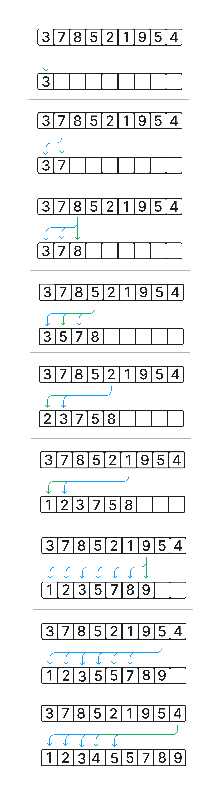

# Interview 02

Implement Insertion Sort.

## Specifications

- Read all of the following instructions carefully.
- Act as an interviewer, giving a candidate a code challenge.
- Score the candidate according to the [Whiteboard Rubric](https://docs.google.com/spreadsheets/d/1scthkmARfzAFZrSYAp6LA2coOaoWUWbSzMbtIU4jcHw){:target="\_blank"}.
- You are free to offer suggestions or guidance (and see how they respond), but don't solve the challenge for the candidate.

## Feature Tasks

- Ask the candidate to write a function to implement insertion sort.
- Avoid utilizing any of the built-in sort methods available in your language.
- Offer an example input array of positive and negative integers.
- The candidate should be able to describe the properties of the algorithm they implement:
  - Is it in-place?
    - Most likely not, depends on implementation.
  - Is it stable?
    - Most likely yes, depends on implementation.
  - Is it adaptable?
    - Only if the sort takes a comparator function.
  - What's the time and space complexity?
    - This is a multiple insertion activity, so probably `O(n^2)`.
      If they perform binary search during the insertion phase, it could be `O(n log n)`.
      If your partner mentions this optimization, but doesn't actually do it, that's totaly OK!
      Binary search is itself an entire interview challenge.
    - Since it likely inserts into a new array, it would be `O(n)` space.
      If they perform the insertion in-place at the front of the array, it could be `O(1)`.

## Structure

Familiarize yourself with the grading rubric, so you know how to score the interview.

Look for effective problem solving, efficient use of time, and effective communication with the whiteboard space available.

Every solution might look a little different, but the candidate should be able to test their solution with different inputs to verify correctness.

Assign points for each item on the Rubric, according to how well the candidate executed on that skill.

Add up all the points at the end, and record the total at the bottom of the page.

## Example

## Documentation

Record detailed notes on the rubric, to share with the candidate when the interview is complete.

## Solution

  
Algorithm

  Insertion sort creates a new array with all elements in the correct order.
  It does this by going item by item in the input array, and inserting it into an output array.
  The index in the output array is selected to keep the item in order.
  It is easiest to do this by going through the output array item by item, finding the first index "larger" than the item being inserted.
  Move all items after that index one higher, and set the inserting item to that index.
  This algorithm can be improved by using a binary sort on the output array to decide the insertion index.

  
PseudoCode

  <pre><code>algorithm InsertionSort:
    declare array ARRAY <- input array values
    declare array OUTPUT <- empty array
    run a loop declaring I starting at 0 and incrementing up to length of ARRAY:
      INSERT into OUTPUT ARRAY value at index I
    return OUTPUT</code></pre>
  <pre><code>algorithm INSERT:
  declare array ARRAY <- input array values
  declare number VALUE <- value to insert into ARRAY
  run a loop declaring I starting at 1 and incrementing up to length of ARRAY:
    if ARRAY at I compares less than VALUE:
      INSERT AT ARRAY index I VALUE
      return
  do INSERT AT ARRAY index 0 VALUE</code></pre>
  <pre><code>algorithm INSERT AT:
  declare array ARRAY <- input array
  declare number INDEX <- index to insert at
  declare number VALUE <- value to insert
  run a loop declaring I starting a index length of ARRAY - 1 decrementing down to INDEX:
    set ARRAY at I to ARRAY at I - 1
  set ARRAY at INDEX to VALUE</code></pre>

  
Big O

  This algorithm is a straight forward iterate the input array / iterate the output array.
  Thus, is has `O(n)` time complexity for each item in the input array, and an `O(n)` complexity for looping the  output array.
  Because this is nested, the overall runtime is `O(n^2)`.
  Note that INSERT loops from 0 to I, and INSERT AT loops from N down to I, so while INSERT AT is nested inside the INSERT loop, it only runs a single time & returns after.
  Because it creates an entire new output array, this is space `O(n)`.

  There are two runtime optimizations that could be done.
  INSERT can be implemented using binary search (because the array is sorted), and becomes `O(log n)`.
  INSERT AT can be implemented using a linked list, and can be `O(1)`.
  The first optimization is tricky to get right, and is an interview question itself.
  Doing both optimizations together gets the algorithm to a theoretical complexity of `O(n log n)`, but is very difficult to do correctly.

  There is one space optimization to be done.
  By tracking the start and end indexes of the arrays explicitly, the INSERT algorithm can "swap" from the right, unsorted portion of the array into the left, sorted portion.
  This makes the operation take only constant additional space for the indexes.
  But, like the runtime optimization, it can be tricky to keep track of all the indexes.

