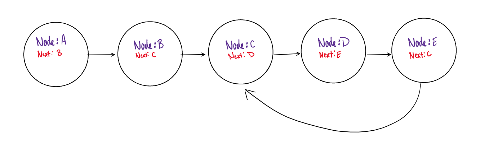

# Circular Linked List

Create a function that determines if a linked list has a circular reference. 

A circular reference is defined as a linked list that, at any point, has a "Next" property that points to any other node in the list (not necesarily the head node).

**Source:** Robert W Floyd's "*Tortoise and the Hare*" Algorithm

## Notes to the Interviewer

**Do not let the student "modify" the `Node` class. They must keep it intact and not add any additional properties to the class.**

Students can use the default `Node` class usually provided within data structures.

The `Node` class has the following properties:
1. Value
2. Next

The student may also use the "built in" linked list if they ask. They may have access to:
1. Head node
2. Add methods

Anything additional (such as pointers) they will have to create themselves. 

The student may also have access to a built in *HashSet<T>*. They do not need to come up with the hash on their own. They can simply utilize the already built in `Add(key)` method to add a value to the hashset. 

### Potential Student Questions

**What is the data type of the linked list?** Doesn't matter, but let's assume integers if you need a data type to continue.

**Are duplicates a possiblity?** Yes. 

**Do I have access to any linked List traversals?** You must implement the traversal yourself.

## Solutions

There are a couple different approaches to this problem. The first solution is the most optimal for both time/space, while the second solution utilizes external data structures. 

### Solution 1 ("Tortoise and Hare")

- Big O Time = O(n)
  - It will take at most one iteration for the "slow" and the "fast" pointers to land on the same node

- Big O Space = O(1)
  - No additional space, in relation to the input, is being added to the problem. 

The most common approach is through the classic "Tortoise and the Hare" algorithm, where you have 2 different nodes while traversing through linked list. The 2 different nodes are:
1. "Slow" pointer (Tortoise)
2. "Fast" pointer (Hare)

Essentially what happens is the tortoise pointer goes the speed of 1 after every iteration and the hare goes two. Eventually, both the tortoise and the hare will land on the same node confirming it is circular. If the hare gets to the end, then we know it is not circular. 

### Solution 2 (Recursion)

- Big O Time = O(n)
  - Worst case: There is not a circular reference and one full traversal is all that is required. 

- Big O Space = O(n)
  - The hashset will hold all of the nodes, making additional space O(n). 

This approach consists of one full traversal of the linked list. Every time an iteration occurs, the node is added to a hashset. As soon as a collision occurs, we know that the node has already been added to the hashset...meaning that there is a circular reference.
