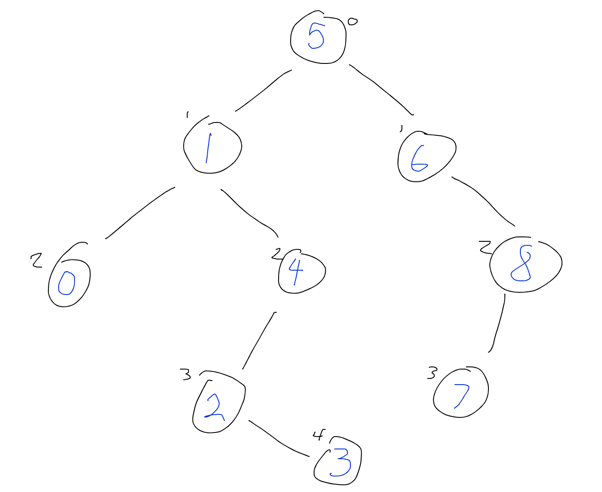

# Find the Furthest Child from the BST's Root

Write a function that takes a binary search tree as an argument. The tree isn't necessarily balanced.

Interviewer choose one from below:

- *Option 1*: Return the value of the node that is the furthest number of steps from the root of the tree.
- *Option 2*: Return the value of the node whose value is the greatest difference from the value of the root node.

## Notes for the Interviewer

The above tree should return `3` for option 1 and `0` for option 2.

- Option 1 requires that we traverse to all the nodes in the tree and therefore the BST hehavior has no effect on our algorithm efficiency.  Watch for students trying to argue O(log n) efficiecies due to lesser and greater node values.
- Option 2 is similar, but since this is a BST we only need to head to the left or the right since we can assume that heading in the other direction will bring us closer to the root value.

### Potential Student Questions

- Should the furthest value include negative numbers? Yes we should be able to evaluate negative values as a distance from the root value.
