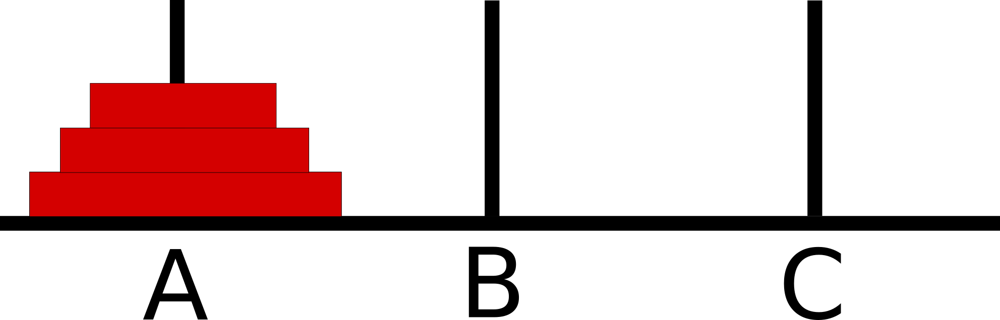

# Towers of Hanoi.

## Specifications

- Read all of the following instructions carefully. Name things exactly as described, or you will get a ZERO without comment 
- Do all your work in a public repository called `data-structures-and-algorithms`, with a well-formated, detailed top level README.md matching the example provided by your instructor
- Create a branch in your repository called `Towers of Hanoi`
- On your branch, create...
    - _C#_: your methods outside of `Main()` in your `Program.cs` file
    - _JavaScript_: a file called `towers-of-hanoi.js`
    - _Python_: a file called `towers_of_hanoi.py`
- Include any language-specific configuration files required for this challenge to become an individual component, module, library, etc.
    - _NOTE: You can find an example of this configuration for your course in your class lecture repository._

## Feature Tasks


- The Towers of Hanoi is a mathematical puzzle where you have 3 towers and N disks of different sizes. 
- The puzzle starts with the disks sorted (i.e. smaller disks sits on top of larger disks) on the left-most tower, and the objective of the puzzle is to move the disks to the right-most tower with the following restrictions:
  - Only one disk can be moved at a given time.
  - A disk is moved from the top of a tower to the top of another tower.
  - A disk can't be placed on top of a smaller disk.
- On your main file, create...
    - _C#_: a function called `void TowersOfHanoi(int n)`
    - _JavaScript_: a function called `towersOfHanoi(n)`
    - _Python_: a function called `towers_of_hanoi(n)`
    - where `n` represents the number of disks.

## Structure and Testing

Utilize the Single-responsibility principle: any methods you write should be clean, reusable, abstract component parts to the whole challenge. You will be given feedback and marked down if you attempt to define a large, complex algorithm in one function definition.

Write at least three test assertions for each method that you define. 

Ensure your tests are passing before you submit your solution.

## Example

| Input | Output |
|-----|----| 
| `2` | `Disk 1 moved from A to B` |
|  | `Disk 2 moved from A to C` |
|  | `Disk 1 moved from B to C` |
| `3` | `Disk 1 moved from A to C` |
|  | `Disk 2 moved from A to B` |
|  | `Disk 1 moved from C to B` |
|  | `Disk 3 moved from A to C` |
|  | `Disk 1 moved from B to A` |
|  | `Disk 2 moved from B to C` |
|  | `Disk 1 moved from A to C` |


## Documentation: Your README.md

```markdown
# Towers of Hanoi
<!-- Short summary or background information -->

## Challenge
<!-- Description of the challenge -->

## Solution
<!-- Embedded whiteboard image -->

```
