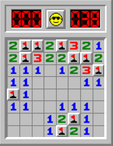

# Minesweeper



Given a 2D array that represents a minefield with randomly placed mines write
a function that returns a 2D array where each index contains the number of
mines at the 8 positions (4 sides, 4 corners too) around that location.

Use the number `9` to indicate that there is a mine at that location.

For example, given this 2D array
* `null` represents an empty cell
* `'*'` represents a mine

```
MINEFIELD = [
  [ null, null, null, null, '*' ],
  [ null, null, null, null, '*' ],
  [ '*', null, null, null, null ],
  [ null, null, null, '*', null ],
  [ null, '*', null, null, null ]
]
```

Return the following:

```
[ [ 0, 0, 0, 2, 9 ],
  [ 1, 1, 0, 1, 9 ],
  [ 9, 0, 1, 1, 1 ],
  [ 1, 1, 2, 9, 0 ],
  [ 1, 9, 0, 0, 0 ] ]
```

* Notice the `0` cells at the top are not touching any mine.
* Notice the two in the first tow touches a mine at two locations:
  * on it's right side
  * diagonally via it's bottom left corner
* The mine in the first column is mostly surrounded by `1` cells,
  except there's a single cell with a `2` which happens to be touching
  another mine below itself.

# Complexity
Your solution should be `O(N)` with respect to the total number of cells in
the 2D array.

