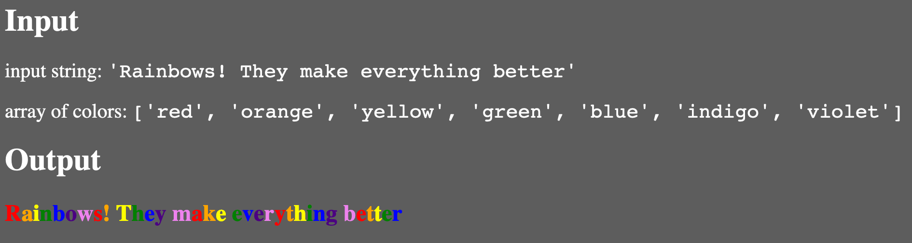

# Rainbow Text

_Source: an actual interview question given to [Emily](https://github.com/emilyaviva) once upon a time_

Given a string and a color palette, give each character in the string the color from the array. You should pass over spaces (really, all whitespace) in the string and not skip colors.

If the string is longer than the number of colors you have, the colors should start again from the beginning. (Think of the color palette as a circular linked list.)

There are several possibilities for how to return your output: at the minimum, the output should be a sequence of key-value pairs where the key is the character and the value is the color name. Aspiring front-end developers should be encouraged to use the DOM API to return a block of `<span>`s styled appropriately.

## Example input/output (do not give unless explicitly asked)



Input:
```javascript
string = 'Rainbows! They make everything better'
palette = [ 'red', 'orange', 'yellow', 'green', 'blue', 'indigo', 'violet' ]
```

Output (the skipped space should ideally be figured out by the student):
```javascript
[
  { 'R': 'red' },
  { 'a': 'orange' },
  { 'i': 'yellow' },
  { 'n': 'green', },
  { 'b': 'blue' },
  { 'o': 'indigo' },
  { 'w': 'violet' },
  { 's': 'red' },
  { '!': 'orange' },
  { ' ': null },
  { 'T': 'yellow' },
  { 'h': 'green' },
  { 'e': 'blue' },
  { 'y': 'indigo' },
  { ' ': null },
  { 'm': 'violet' },
  { 'a': 'red' },
  ...
]
```
Or, for someone whose DOM API knowledge you want to challenge:
```html
<span>
  <span style="color: red;">R</span>
  <span style="color: orange;">a</span>
  <span style="color: yellow;">i</span>
  ...
  <!-- a skipped space might look like this -->
  <span> </span>
  ...
</span>
```

## Answers to Likely Clarifying Questions
- All whitespace should be skipped and should not be assigned a color.
- After skipped whitespace, the colors should continue from where they were before the whitespace.
- Punctuation marks should **not** be skipped and must be assigned a color.
- The rainbow colors are an example only: your algorithm should not assume there are seven, or any other, number of colors in the palette.

## For the Interviewer: notes about this problem
Since the list of color names is a circular linked list, we can go one-to-one between characters in the input string and color names, looping endlessly over the color names…except we need to know how to skip spaces. Therefore, the trick is that you _can't_ use the index of the loop through the input string: you have to have a separate counter for how many actually-colorable characters you've seen so far. You can then use that counter to find which color you should assign your output to.

One correct algorithm looks something like this:

```
define function rainbowText (input: string, palette: array):
  output := []
  colorableCharacterCounter := 0
  for character index i in input:
    if input[i] matches any whitespace:
      append { input[i]: null } to output
    else
      append { input[i]: palette[colorableCharacterCounter % palette.length] } to output
      colorableCharacterCounter += 1
    end if
  end for
  return output
end define
```

Here is a [solution]('./rainbowText.js') using JavaScript and the DOM API.

The time complexity should not be greater than O(_n_). If it is, something's wrong with your algorithm: you don't need multiple `for` loops to make this work.
